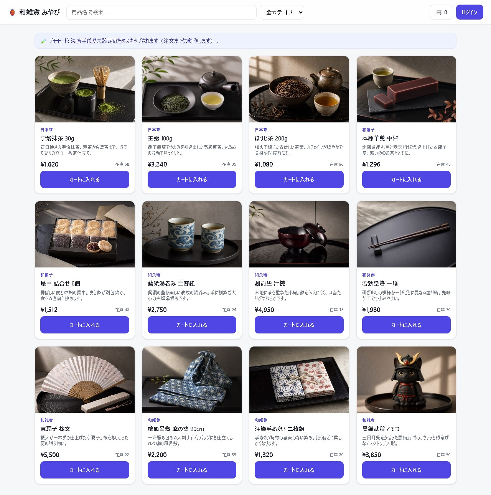

# EC API — Spring Boot の EC バックエンド ＋ ストアフロント

ECサイトに必要な主要機能を一通り備えた、コンパクトな実装です。認証（JWT）、商品・カテゴリ管理、カート、ゲスト購入、在庫予約、消費税計算、注文、Stripeのテスト決済、管理機能を備えたREST APIと、それらを利用する素のHTML/CSS/JavaScript製のストアフロントを同梱しています。商品詳細ページと管理パネルも用意しており、Swagger UIと実際の画面の両方から動作を試せます。

**▶ 公開デモ: <https://lab.4510.be/ec/>** （API 仕様は <https://lab.4510.be/ec/swagger-ui.html>）



## 技術構成

- Java 21 / Spring Boot 3.3
- Spring Web / Spring Data JPA / Spring Security（JWT: jjwt）/ Bean Validation
- PostgreSQL（本番・docker-compose）/ H2 インメモリ（デフォルト・ゼロ設定起動）
- springdoc-openapi（Swagger UI）/ Stripe Java SDK（テストモード）
- フロントは **依存ゼロのバニラ JS**（`src/main/resources/static/`・ビルド不要）
- Docker マルチステージビルド。本番は Oracle Cloud の VM 上で Docker Compose（Caddy がリバースプロキシ）

## 主な特徴

### 在庫は「予約（hold）」してから確定する

チェックアウトは在庫を**減算せず予約**します。商品には `stock`（総在庫）と `available`（= `stock` − 未払い注文が握っている数）があり、売り越しを防ぎつつ「カートに入れただけで在庫が消える」ことも起きません。

```
checkout → PENDING（在庫を hold）
   ├─ Stripe webhook で支払い確認 → PAID（在庫を実減算）
   └─ 30分（APP_ORDER_HOLD_MINUTES）以内に未払い → EXPIRED（hold を自動解放）
```

期限切れの掃除は `OrderExpiryScheduler` が定期実行します。**Stripe キー未設定でもアプリは正常に動き**、注文は PENDING のまま作られて期限で自動解放されます。

### 金額は段階で組み立てる（商品 → 割引 → 送料 → 税 → 合計）

計算は `pricing/OrderPricer` に独立していて、**在庫を1つも動かさずに金額だけ出せます**。同じ計算器を
注文（`POST /api/orders/checkout`）と見積もり（`POST /api/checkout/quote`）の両方が通るので、
**カートに出た金額がそのまま請求額**になります（店頭側に「概算」の再実装がありません）。

注文には次の5つがスナップショットされ、常に恒等式が成り立ちます:

```
合計 = 小計（税抜・割引前） − 割引 + 送料（税抜） + 消費税
```

| 論点 | どうしているか |
|---|---|
| **割引と税の順序** | 割引は**税額に反映されます**（割引後の金額に課税）。総額から最後に引くと、客が払っていない分にまで課税されるため |
| **税率の違う行への割引** | 金額比で**按分**し、端数は最大の行に寄せる。行ごとの割引の合計は注文の割引額と**1円もずれません** |
| **定額クーポンの読み方** | 商品価格と同じ流儀（内税なら税込から、外税なら税抜から）。「500円引き」は値札の隣の数字から500円 |
| **送料の税率** | **標準税率**。軽減税率は飲食料品等に対するもので運賃には及びません |
| **送料無料の判定** | **割引後**の商品合計で判定。割引前だと「3,000円引きを使ったのに送料無料のまま」になります |
| **クーポンの引き換え数** | 在庫の引当と同じ条件付き UPDATE。上限の最後の1枚を2人が同時に取ることはありません。**キャンセル・期限切れでは戻ります**（売上にならなかったため） |

送料（`PUT /api/admin/settings/shipping`）とクーポン（`/api/admin/coupons`）は管理画面から**再デプロイ無しで**変更できます。

### 消費税は「有効期間つき税率 × 注文時スナップショット」

- 税率は `tax_rates` テーブルで**有効期間つき**に管理（標準10% / 軽減8%。将来日付の予約改定も可）。
- 注文確定時に**税率・税額を注文明細へ凍結**するので、税率改定後も過去の注文は金額が変わりません。
- **内税（INCLUSIVE）/ 外税（EXCLUSIVE）を管理画面から再デプロイ無しで切替**可能。切替は将来の注文にだけ効きます。
- 端数処理は行ごとに切り捨て（既定。`APP_TAX_ROUNDING` で変更可）。

### 会員でもゲストでも買える

ゲストはメールアドレスと明細を渡すだけで購入でき、レスポンスで一度だけ返る**推測不能なトークン**で後から注文を照会します（`GET /api/orders/guest/{id}?token=...`）。サーバー側カートを持たないため、フロントは localStorage で持ちます。照会用の画面は `#/orders/guest`（[ストアフロント](#ストアフロント同梱-ui)参照）。

## エンドポイント

| 領域 | エンドポイント | 権限 |
|---|---|---|
| 認証 | `POST /api/auth/register`, `/login`, `GET /api/auth/me` | 公開 / 本人 |
| 商品（閲覧） | `GET /api/products`（検索 `q`・`categoryId`・ページング・`sort`）, `GET /api/products/{id}` | 公開 |
| カテゴリ（閲覧） | `GET /api/categories`, `/{id}` | 公開 |
| カート（会員） | `GET /api/cart`, `POST /api/cart/items`, `PUT/DELETE /api/cart/items/{productId}`, `DELETE /api/cart` | ユーザー |
| 注文（会員） | `POST /api/orders/checkout`, `GET /api/orders`, `/{id}` | ユーザー（本人のみ） |
| 注文（ゲスト） | `POST /api/orders/guest-checkout`, `GET /api/orders/guest/{id}?token=` | 公開（トークン照合） |
| 税（公開） | `GET /api/tax/config`（内税/外税と現行税率） | 公開 |
| 見積もり（公開） | `POST /api/checkout/quote`（送料・クーポン込みの金額。在庫は動かない）, `GET /api/checkout/shipping` | 公開 |
| 決済 | `GET /api/payments/config`, `POST /api/payments/orders/{id}/checkout-session?provider=`, `POST /api/payments/guest/orders/{id}/checkout-session`, `POST /api/payments/{providerId}/webhook`, `GET /api/payments/{providerId}/instructions` | 公開 / 本人 |
| 管理: 商品 | `POST/PUT/DELETE /api/admin/products` | ADMIN |
| 管理: 商品画像 | `POST /api/admin/products/{id}/image`（multipart `file`）, `DELETE /api/admin/products/{id}/image` | ADMIN |
| 管理: カテゴリ | `POST/PUT/DELETE /api/admin/categories` | ADMIN |
| 管理: 注文 | `GET /api/admin/orders`, `/{id}`, `PATCH /api/admin/orders/{id}/status` | ADMIN |
| 管理: 税率 | `GET/POST/PUT/DELETE /api/admin/tax-rates` | ADMIN |
| 管理: 設定 | `GET /api/admin/settings`, `PUT /api/admin/settings/pricing-mode`, `PUT /api/admin/settings/shipping` | ADMIN |
| 管理: クーポン | `GET/POST/PUT/DELETE /api/admin/coupons` | ADMIN |

注文明細には購入時点の**商品名・単価・税区分・税率・税額**をスナップショット保存します。

## ストアフロント（同梱 UI）

`/` を開くと商品一覧が出ます。ハッシュルーティングなので URL をそのまま共有できます。

| ルート | 内容 |
|---|---|
| `#/`（既定） | 商品グリッド（検索・カテゴリ絞り込み・ページング） |
| `#/product/{id}` | 商品詳細（大画像・在庫・カート追加。deep link 可） |
| `#/admin` | 管理パネル。**ADMIN でログインしたときだけ**ヘッダに「⚙️ 管理」が出る |
| `#/orders/guest` | **ゲスト注文の照会**。注文番号＋トークンで確認する。未ログイン時だけヘッダに「🔎 注文照会」が出る |
| `#/orders/guest/{id}/{token}` | 上記の deep link。1件の注文をブックマークできる |

管理パネルからは **内税/外税トグル**・**税率テーブルの追加・改定・削除**・**送料の設定**・**クーポンの管理**・**商品画像の差し替え**ができます（「適用中」バッジはサーバーの実効税率判定と同じロジック＝終了日は排他的）。カートにはクーポン入力欄と金額内訳（小計 / 割引 / 送料 / 消費税 / 合計）が出ます。この数字は**サーバーの見積もりAPIがそのまま返したもの**です。

### 商品画像のアップロード

管理パネルの「商品画像」から、商品ごとに1枚を差し替えられます。選んだ時点で即反映（「選択」と「保存」を分けない）。

**受け付ける条件は先頭バイトで判定します。** 拡張子も `Content-Type` もリクエスト側の申告でしかないため、判定材料にしていません。

| 項目 | 仕様 |
|---|---|
| 形式 | JPEG / PNG / WebP のみ |
| **SVG** | **拒否**。XML にスクリプトを埋められ、これを自サイトのオリジンから配信すると保存型 XSS になる |
| サイズ | 既定 2MB（`APP_UPLOADS_MAX_SIZE` / `APP_UPLOADS_MAX_BYTES`）。超過は **413** |
| 保存名 | サーバーが生成（`p{商品ID}-{乱数}.{拡張子}`）。**クライアントのファイル名は使わない**＝パストラバーサルの材料が無い |
| 保存先 | `APP_UPLOADS_DIR`（既定 `./data/uploads`）。作成できない/読み取り専用ならアップロードだけ **503**（他機能は通常どおり） |
| 公開URL | `images/uploads/…`（相対パス。`/ec` 配下でもそのまま解決される） |

差し替え・画像を外す・商品削除のいずれでも、**こちらがアップロードした実体ファイルは一緒に消えます**。同梱画像（`images/products/…`）や外部URLを指していた場合はファイルに触りません（jar の中身であって、こちらの持ち物ではないため）。

> ⚠️ **保存先は jar の外に置く必要があります。** コンテナを作り直すと消えるため、本番（oracle-lab）では
> `./ec-uploads:/app/uploads` をマウントし、rsync の `--delete` からも除外しています。
> 日次バックアップにも `ecuploads_*.tar.gz` として含めています（DB の `imageUrl` だけ戻しても画像は 404 になるため）。

### ゲスト注文の照会

アカウントが無いので、**注文番号 + トークン**が本人確認そのものです。画面は2つの入り口を持ちます。

- **手入力** — 控えたトークンを貼れば、どの端末・どのブラウザからでも引けます。
- **この端末に記録された注文** — ゲスト購入時に `localStorage` へ id とトークンを保存しているので、控え忘れても同じブラウザなら一覧から開けます。**サーバーにこの一覧はありません**（アカウントが無いため）。共用端末向けに個別／一括の削除ボタンを置いています。

注文確定バナーからも照会ページへのリンクが出ます（トークンが「一度表示して終わり」にならないように）。
照会結果からは支払い（`PENDING` のとき）へ進めます。期限切れの注文は `EXPIRED` として在庫解放済みの旨を表示します。

> API は「存在しない注文」と「トークン違い」を区別せず **どちらも 404** を返します。画面のメッセージも1種類に揃えてあり、注文IDの総当たりで存在有無を推測できないようにしています。

## ローカル実行

> **`<Port>` について**: コマンド中の `<Port>` は**ホスト側の公開ポート**で、任意の空きポートに置き換えてください。`-p <Port>:8080` の右側（コンテナ内ポート）は常に **8080 固定**です。

### A. Docker 単体（H2 インメモリ・最速）

```bash
docker build -t ec-api .
docker run --rm -p 8080:8080 ec-api
# → http://localhost:8080/            （ストアフロント）
# → http://localhost:8080/swagger-ui.html
```

### B. Docker Compose（API + PostgreSQL・本番相当）

```bash
docker compose up --build
# → http://localhost:8080/swagger-ui.html
# ホストポートは docker-compose.yml の ports で定義（既定 8080）
```

> ローカルに JDK は不要（すべて Docker 内でビルド）。JDK 21 + Maven があれば `mvn spring-boot:run` でも可。

## テスト

```bash
mvn -B clean test
# JDK が無ければ Docker で:
docker run --rm -v "$PWD:/app" -w /app maven:3-eclipse-temurin-26 mvn -B clean test
```

H2 インメモリで完結するので、DB もネットワークサービスも不要です。中身は在庫ライフサイクル（引当 → 確定 or 解放）の回帰テストで、**Webhook の重複配信で二重に在庫が減らないこと**・**管理画面からの手動 PAID でも引当が実減算に変換されること**を固定しています。CI（`.github/workflows/deploy-notify.yml`）ではこれが通ったときだけデプロイが走ります。

## スキーマ管理（Flyway）

スキーマの正は `src/main/resources/db/migration/` のマイグレーションです。Hibernate は `ddl-auto=validate`＝**スキーマを変更せず、エンティティとずれていたら起動時に落とす**役割だけを持ちます。

| ファイル | 内容 |
|---|---|
| `V1__baseline_schema.sql` | ベースライン。既存DBでは実行されず「適用済み」として記録される（`baseline-on-migrate`）。実際に走るのは空DB（テストのH2・新規環境）だけ |
| `V2__drop_orders_stripe_session_id.sql` | 決済のプラグイン化で不要になった Stripe 固有列を撤去（捨てる前に `payment_reference` へ移行） |
| `V3__fix_orders_status_check_and_guest_user_id.sql` | 実DBに残っていたエンティティとの不整合を是正（後述） |
| `V4__coupons_and_order_pricing_stages.sql` | 金額の段階（割引・送料）の列と `coupons` テーブル。追加列は `NOT NULL DEFAULT 0`＝**既存注文でも恒等式が成り立つ**（0 は「不明」ではなく正しい値） |

- SQL は **H2 と PostgreSQL の両方で動く書き方**に限定しています。テストは H2 で走るので、マイグレーションが壊れれば CI が赤くなる＝本番に出る前に気づけます。
- CHECK 制約には明示的な名前（`ck_orders_status` など）を付けます。自動生成名だと後から `ALTER` で直せません。
- 緊急時は `SPRING_FLYWAY_ENABLED=false` で無効化できます（`ddl-auto=validate` は残るので、スキーマが合っていなければ起動しません）。

> 💡 **なぜ `ddl-auto=update` をやめたか。** `update` は列を足すだけで、CHECK 制約の作り直しも `NOT NULL` の緩和もしません。そのため機能追加のたびに実DBだけが静かに古いまま取り残されます。実際 Flyway 導入時に、**`orders.status` の CHECK に `EXPIRED` が無く、未入金注文の期限切れ処理が実DBで必ず失敗する**状態が見つかりました（アプリ側は正しく、DBだけが古かった）。`validate` はこの種のずれを起動時に検出します。

## 初期データ（シード）

`APP_SEED_ENABLED=true`（デフォルト）で起動時に投入されます。

- 管理者: `admin@example.com` / `admin1234`
- デモユーザー: `user@example.com` / `user1234`
- カテゴリ4件・商品12件（和雑貨セレクトショップ想定: 日本茶 / 和菓子 / 和食器 / 和雑貨）、税率（標準10% / 軽減8%・2019-10-01〜）
  - 飲食料品（日本茶・和菓子）は**軽減8%**、器と雑貨は**標準10%**。1つのカートに両方入れると税区分ごとの内訳が出るので、消費税計算の挙動をそのまま確認できます。
  - 商品画像は**外部サービスではなく同梱の写真**（`static/images/products/*.jpg`）。外部依存ゼロで、オフラインでも欠けません。

> ⚠️ **シードが走るのは「まだデータが無いDB」だけです。** 稼働中のDBのカタログを入れ替えたい場合、`DataSeeder` を書き換えても反映されません。マイグレーション（`V4__...sql`）として書いてください。スキーマだけでなくデータの入れ替えも Flyway が運べます。

> ⚠️ **これはローカル/デモ用のシード値です。** 公開環境では必ず `APP_ADMIN_EMAIL` / `APP_ADMIN_PASSWORD` と `APP_JWT_SECRET` を環境変数で上書きしてください（公開デモも既定値では動かしていません）。

## 使い方（最短フロー）

```bash
BASE=http://localhost:8080

# --- 会員として買う ---
curl -s -X POST $BASE/api/auth/login \
  -H 'Content-Type: application/json' \
  -d '{"email":"user@example.com","password":"user1234"}'
TOKEN=...   # 返ってきた token

curl -X POST $BASE/api/cart/items \
  -H "Authorization: Bearer $TOKEN" -H 'Content-Type: application/json' \
  -d '{"productId":1,"quantity":2}'

curl -X POST $BASE/api/orders/checkout -H "Authorization: Bearer $TOKEN"

# --- ゲストとして買う（アカウント不要）---
curl -s -X POST $BASE/api/orders/guest-checkout \
  -H 'Content-Type: application/json' \
  -d '{"email":"guest@example.com","items":[{"productId":1,"quantity":1}]}'
# → レスポンスの orderToken を控える（返るのはこの一度きり）
curl -s "$BASE/api/orders/guest/1?token=<orderToken>"
# 画面から見る場合: $BASE/#/orders/guest/1/<orderToken>
# （同じブラウザで購入したなら、ヘッダの「🔎 注文照会」に記録が残っている）

# --- 現在の税設定 ---
curl -s $BASE/api/tax/config
```

Swagger UI なら右上の **Authorize** にトークンを貼れば全エンドポイントを画面から試せます。

## 環境変数

| 変数 | 用途 | デフォルト |
|---|---|---|
| `SPRING_PROFILES_ACTIVE` | `postgres` で PostgreSQL 有効化 | （未指定＝H2） |
| `SPRING_DATASOURCE_URL` / `_USERNAME` / `_PASSWORD` | DB接続 | — |
| `SPRING_FLYWAY_ENABLED` | 起動時のスキーマ・マイグレーション | true |
| `APP_JWT_SECRET` | JWT署名鍵（32バイト以上） | 開発用ダミー |
| `APP_JWT_EXPIRATION_MS` | トークン有効期限 | 86400000（24h） |
| `APP_SEED_ENABLED` | 起動時シード | true |
| `APP_ADMIN_EMAIL` / `APP_ADMIN_PASSWORD` | 初期管理者 | admin@example.com / admin1234 |
| `APP_ORDER_HOLD_MINUTES` | 未払い注文が在庫を保持する時間 | 30 |
| `APP_ORDER_EXPIRY_SWEEP_MS` | 期限切れ掃除の実行間隔 | 60000 |
| `APP_TAX_PRICING_MODE` | `INCLUSIVE`（内税）/ `EXCLUSIVE`（外税）の**初期値**（以後は管理画面の設定が優先） | INCLUSIVE |
| `APP_TAX_ROUNDING` | 端数処理 `FLOOR` / `HALF_UP` / `CEILING` | FLOOR |
| `APP_SHIPPING_FEE` | 送料の**初期値**（以後は管理画面の設定が優先）。0 なら送料なし | 0 |
| `APP_SHIPPING_FREE_THRESHOLD` | 送料無料になる金額の**初期値**（割引後の商品合計で判定）。0 なら無料にならない | 0 |
| `APP_CONTEXT_PATH` | サブパス配信時のプレフィックス（本番は `/ec`） | （空＝ルート） |
| `APP_UPLOADS_DIR` | 商品画像の保存先（**jar の外・永続ボリューム推奨**） | `./data/uploads` |
| `APP_UPLOADS_MAX_SIZE` / `APP_UPLOADS_MAX_BYTES` | 1ファイルの上限（前者は multipart 側・後者はアプリ側。**揃えること**） | 2MB / 2097152 |
| `PUBLIC_BASE_URL` | 通知メールに載せる絶対リンクの基点（context-path 込み。例 `https://lab.4510.be/ec`） | （空＝直リンクの代わりに注文番号＋トークンを本文に記載） |
| `PAYMENT_CURRENCY` | 通貨（決済手段によらない共通設定） | jpy（`STRIPE_CURRENCY` も後方互換で有効） |
| `PAYMENT_DEFAULT_PROVIDER` | 決済手段未指定時の既定 id | stripe（無効なら有効な手段へ自動フォールバック） |
| `STRIPE_SECRET_KEY` | Stripe テストキー `sk_test_...`（空=Stripe無効） | （空） |
| `STRIPE_WEBHOOK_SECRET` | Webhook 署名シークレット `whsec_...` | （空） |
| `STRIPE_SUCCESS_URL` / `STRIPE_CANCEL_URL` | 決済後リダイレクト先 | `/api/payments/*` |
| `BANK_TRANSFER_ENABLED` | 銀行振込を決済手段として有効化 | false |
| `BANK_TRANSFER_ACCOUNT` / `BANK_TRANSFER_NOTE_DAYS` | 案内ページに出す振込先・入金確認目安 | サンプル値 / 3 |
| `NOTIFY_MAIL_ENABLED` | 注文イベントのメール通知を有効化（別途 `spring.mail.*` が必要） | false |
| `NOTIFY_MAIL_FROM` / `NOTIFY_MAIL_ADMIN` | 送信元 / 受注控えの宛先（空=送らない） | no-reply@example.com / （空） |
| `PORT` | **アプリ待受ポート（コンテナ内）** | 8080 |

## 拡張点（プラグイン）

機能追加のうち「増えることが分かっているもの」は、コアを変更せずに実装を足せる形にしてあります。どちらも **`@Component` を置くだけ**で自動登録されます。

### 決済手段 — `PaymentProvider`

決済業者ごとの差異（セッション作成・署名検証）を実装側に閉じ込める契約です。同梱の実装は2つ:

| id | 実装 | 有効化 |
|---|---|---|
| `stripe` | Stripe Checkout（ホスト型・テストモード） | `STRIPE_SECRET_KEY` |
| `bank_transfer` | 銀行振込。**外部APIもWebhookも持たない**手段が同じ契約に収まることの実証 | `BANK_TRANSFER_ENABLED=true` |

有効な手段は `GET /api/payments/config` に現れ、ストアフロントのボタンもその一覧から生成されるため、**実装を1つ足してもフロント／コアのコードは変更不要**です。

```bash
# 決済手段の一覧
curl -s $BASE/api/payments/config | jq .providers

# 支払い開始（provider 省略時は既定）— 返る redirectUrl を開く
curl -s -X POST "$BASE/api/payments/orders/1/checkout-session?provider=stripe" \
  -H "Authorization: Bearer $TOKEN" | jq -r .redirectUrl
```

Webhook は `POST /api/payments/{providerId}/webhook`（署名検証は各実装の中で完結）。
Stripe のローカル転送は Stripe CLI: `stripe listen --forward-to localhost:<Port>/api/payments/stripe/webhook`

テストカードは **`4242 4242 4242 4242`**（有効期限=任意の未来 / CVC=任意）。

> ⚠️ **Stripe のキーを入れるなら Webhook 登録もセットで。** 実減算の契機は Webhook なので、キーだけ設定して Webhook 未登録だと「支払ったのに期限切れで EXPIRED」になります。
> ⚠️ **テストモード限定運用**。`sk_test_` / `whsec_` のみを使用し、本番(live)キー・実カードは扱いません。キーはコミットせず環境変数で渡します。

### 注文イベント — `OrderEventListener`

注文成立・支払確定・キャンセル・期限切れを受け取る拡張点です。メール送信・Slack通知・会計連携・分析イベントはここに載せます（コアはイベントを発行するだけで、通知手段を一切知りません）。

| イベント | 発行される時点 |
|---|---|
| `OrderPlacedEvent` | 注文が成立し在庫を引き当てた（PENDING・**未払い**） |
| `OrderPaidEvent` | 支払確定。引当が実在庫の減算に変換された |
| `OrderCancelledEvent` | 明示的なキャンセル |
| `OrderExpiredEvent` | 保留期間内に支払われず自動失効 |

- 呼び出しは**トランザクションのコミット後**。「注文はロールバックしたのにメールだけ飛ぶ」が起きません。
- 1つのリスナーが例外を投げても、他のリスナーは走りきります（障害の隔離）。
- 同梱の実装: 監査ログ出力（常時有効）／メール通知（`NOTIFY_MAIL_ENABLED=true`）。

#### ゲスト注文の照会リンク

ゲスト注文の通知メールには、`#/orders/guest/{id}/{token}` への直リンクが入ります。ゲストの照会トークンは**注文確定バナーに一度出るだけ**なので、メールが「あとで注文に戻る」唯一の確実な手段になります（支払えるのは PENDING の間だけ）。

- リンクの基点は `PUBLIC_BASE_URL`。未設定なら直リンクは作らず、注文番号と照会トークンを本文に載せます（照会ページに手入力すれば同じ結果）。
- トークンは**提示できれば注文の閲覧と支払いができる資格情報**です。載せるのは注文受付・支払完了の通知（本人宛）だけで、**管理者への受注控えとキャンセル・失効の通知には載せません**。会員注文にも載りません（ログインして注文履歴から辿れるため）。監査ログにも出しません。

## デプロイ

本番は **Oracle Cloud の VM 上で Docker Compose**（Caddy がリバースプロキシ）で動いており、`APP_CONTEXT_PATH=/ec` を渡して <https://lab.4510.be/ec/> に配信しています。`main` への push で自動デプロイされます（デプロイ定義はインフラ側の別リポジトリ）。

コンテナ1つで完結するので、Dockerfile がそのまま使える環境（Render / Fly.io / Cloud Run 等）にも載ります。

## 今後の拡張候補

- 商品画像アップロード、レビュー、在庫のペシミスティックロック
- 管理パネルの対象拡張（商品・カテゴリ・注文は現状 Swagger / curl から操作）
- Flyway でマイグレーション管理、統合テスト（Testcontainers）
- 金額計算の段階化（送料・クーポン・会員割引・ポイント）——現在は小計/税/合計を一括計算しており、これらを差し込む段がない

## 🤝 コントリビュート

Issue や Pull Request を歓迎します。バグ報告・機能提案はお気軽にどうぞ。

## 📄 ライセンス

本プロジェクトは [MIT License](./LICENSE) のもとで公開されています。商用・改変・再配布を含め、自由にご利用いただけます。
