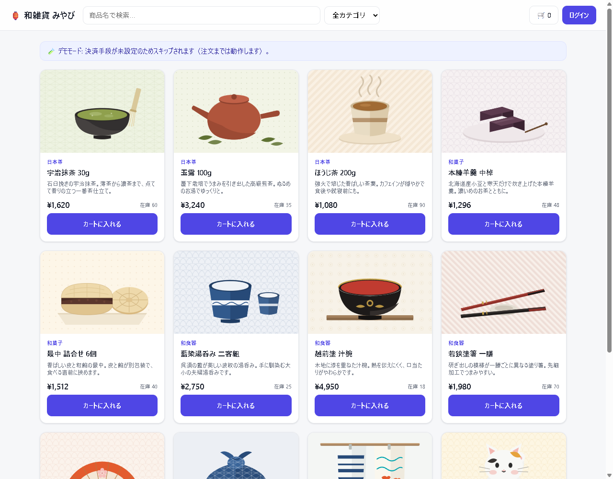

# EC API — Spring Boot の EC バックエンド ＋ ストアフロント

ECサイトに必要な主要機能を一通り備えた、コンパクトな実装です。認証（JWT）、商品・カテゴリ管理、カート、ゲスト購入、在庫予約、消費税計算、注文、Stripeのテスト決済、管理機能を備えたREST APIと、それらを利用する素のHTML/CSS/JavaScript製のストアフロントを同梱しています。商品詳細ページと管理パネルも用意しており、Swagger UIと実際の画面の両方から動作を試せます。

**▶ 公開デモ: <https://lab.4510.be/ec/>** （API 仕様は <https://lab.4510.be/ec/swagger-ui.html>）



## 技術構成

- Java 21 / Spring Boot 3.3
- Spring Web / Spring Data JPA / Spring Security（JWT: jjwt）/ Bean Validation
- PostgreSQL（本番・docker-compose）/ H2 インメモリ（デフォルト・ゼロ設定起動）
- springdoc-openapi（Swagger UI）/ Stripe Java SDK（テストモード）
- フロントは **依存ゼロのバニラ JS**（`src/main/resources/static/`・ビルド不要）
- Docker マルチステージビルド。本番は Oracle Cloud の VM 上で Docker Compose（Caddy がリバースプロキシ）

## 主な特徴

### 在庫は「予約（hold）」してから確定する

チェックアウトは在庫を**減算せず予約**します。商品には `stock`（総在庫）と `available`（= `stock` − 未払い注文が握っている数）があり、売り越しを防ぎつつ「カートに入れただけで在庫が消える」ことも起きません。

```
checkout → PENDING（在庫を hold）
   ├─ Stripe webhook で支払い確認 → PAID（在庫を実減算）
   └─ 30分（APP_ORDER_HOLD_MINUTES）以内に未払い → EXPIRED（hold を自動解放）
```

期限切れの掃除は `OrderExpiryScheduler` が定期実行します。**Stripe キー未設定でもアプリは正常に動き**、注文は PENDING のまま作られて期限で自動解放されます。

### 消費税は「有効期間つき税率 × 注文時スナップショット」

- 税率は `tax_rates` テーブルで**有効期間つき**に管理（標準10% / 軽減8%。将来日付の予約改定も可）。
- 注文確定時に**税率・税額を注文明細へ凍結**するので、税率改定後も過去の注文は金額が変わりません。
- **内税（INCLUSIVE）/ 外税（EXCLUSIVE）を管理画面から再デプロイ無しで切替**可能。切替は将来の注文にだけ効きます。
- 端数処理は行ごとに切り捨て（既定。`APP_TAX_ROUNDING` で変更可）。

### 会員でもゲストでも買える

ゲストはメールアドレスと明細を渡すだけで購入でき、レスポンスで一度だけ返る**推測不能なトークン**で後から注文を照会します（`GET /api/orders/guest/{id}?token=...`）。サーバー側カートを持たないため、フロントは localStorage で持ちます。

## エンドポイント

| 領域 | エンドポイント | 権限 |
|---|---|---|
| 認証 | `POST /api/auth/register`, `/login`, `GET /api/auth/me` | 公開 / 本人 |
| 商品（閲覧） | `GET /api/products`（検索 `q`・`categoryId`・ページング・`sort`）, `GET /api/products/{id}` | 公開 |
| カテゴリ（閲覧） | `GET /api/categories`, `/{id}` | 公開 |
| カート（会員） | `GET /api/cart`, `POST /api/cart/items`, `PUT/DELETE /api/cart/items/{productId}`, `DELETE /api/cart` | ユーザー |
| 注文（会員） | `POST /api/orders/checkout`, `GET /api/orders`, `/{id}` | ユーザー（本人のみ） |
| 注文（ゲスト） | `POST /api/orders/guest-checkout`, `GET /api/orders/guest/{id}?token=` | 公開（トークン照合） |
| 税（公開） | `GET /api/tax/config`（内税/外税と現行税率） | 公開 |
| 決済 | `GET /api/payments/config`, `POST /api/payments/orders/{id}/checkout-session?provider=`, `POST /api/payments/guest/orders/{id}/checkout-session`, `POST /api/payments/{providerId}/webhook`, `GET /api/payments/{providerId}/instructions` | 公開 / 本人 |
| 管理: 商品 | `POST/PUT/DELETE /api/admin/products` | ADMIN |
| 管理: カテゴリ | `POST/PUT/DELETE /api/admin/categories` | ADMIN |
| 管理: 注文 | `GET /api/admin/orders`, `/{id}`, `PATCH /api/admin/orders/{id}/status` | ADMIN |
| 管理: 税率 | `GET/POST/PUT/DELETE /api/admin/tax-rates` | ADMIN |
| 管理: 設定 | `GET /api/admin/settings`, `PUT /api/admin/settings/pricing-mode` | ADMIN |

注文明細には購入時点の**商品名・単価・税区分・税率・税額**をスナップショット保存します。

## ストアフロント（同梱 UI）

`/` を開くと商品一覧が出ます。ハッシュルーティングなので URL をそのまま共有できます。

| ルート | 内容 |
|---|---|
| `#/`（既定） | 商品グリッド（検索・カテゴリ絞り込み・ページング） |
| `#/product/{id}` | 商品詳細（大画像・在庫・カート追加。deep link 可） |
| `#/admin` | 管理パネル。**ADMIN でログインしたときだけ**ヘッダに「⚙️ 管理」が出る |

管理パネルからは **内税/外税トグル**と**税率テーブルの追加・改定・削除**ができます（「適用中」バッジはサーバーの実効税率判定と同じロジック＝終了日は排他的）。カートには税内訳（小計 / 消費税 / 合計）が出ます。

## ローカル実行

> **`<Port>` について**: コマンド中の `<Port>` は**ホスト側の公開ポート**で、任意の空きポートに置き換えてください。`-p <Port>:8080` の右側（コンテナ内ポート）は常に **8080 固定**です。

### A. Docker 単体（H2 インメモリ・最速）

```bash
docker build -t ec-api .
docker run --rm -p 8080:8080 ec-api
# → http://localhost:8080/            （ストアフロント）
# → http://localhost:8080/swagger-ui.html
```

### B. Docker Compose（API + PostgreSQL・本番相当）

```bash
docker compose up --build
# → http://localhost:8080/swagger-ui.html
# ホストポートは docker-compose.yml の ports で定義（既定 8080）
```

> ローカルに JDK は不要（すべて Docker 内でビルド）。JDK 21 + Maven があれば `mvn spring-boot:run` でも可。

## 初期データ（シード）

`APP_SEED_ENABLED=true`（デフォルト）で起動時に投入されます。

- 管理者: `admin@example.com` / `admin1234`
- デモユーザー: `user@example.com` / `user1234`
- カテゴリ4件・商品12件（和雑貨セレクトショップ想定: 日本茶 / 和菓子 / 和食器 / 和雑貨）、税率（標準10% / 軽減8%・2019-10-01〜）
  - 飲食料品（日本茶・和菓子）は**軽減8%**、器と雑貨は**標準10%**。1つのカートに両方入れると税区分ごとの内訳が出るので、消費税計算の挙動をそのまま確認できます。
  - 商品画像は**外部サービスではなく同梱SVG**（`static/images/products/`）。外部依存ゼロで、オフラインでも欠けません。

> ⚠️ **これはローカル/デモ用のシード値です。** 公開環境では必ず `APP_ADMIN_EMAIL` / `APP_ADMIN_PASSWORD` と `APP_JWT_SECRET` を環境変数で上書きしてください（公開デモも既定値では動かしていません）。

## 使い方（最短フロー）

```bash
BASE=http://localhost:8080

# --- 会員として買う ---
curl -s -X POST $BASE/api/auth/login \
  -H 'Content-Type: application/json' \
  -d '{"email":"user@example.com","password":"user1234"}'
TOKEN=...   # 返ってきた token

curl -X POST $BASE/api/cart/items \
  -H "Authorization: Bearer $TOKEN" -H 'Content-Type: application/json' \
  -d '{"productId":1,"quantity":2}'

curl -X POST $BASE/api/orders/checkout -H "Authorization: Bearer $TOKEN"

# --- ゲストとして買う（アカウント不要）---
curl -s -X POST $BASE/api/orders/guest-checkout \
  -H 'Content-Type: application/json' \
  -d '{"email":"guest@example.com","items":[{"productId":1,"quantity":1}]}'
# → レスポンスの orderToken を控える（返るのはこの一度きり）
curl -s "$BASE/api/orders/guest/1?token=<orderToken>"

# --- 現在の税設定 ---
curl -s $BASE/api/tax/config
```

Swagger UI なら右上の **Authorize** にトークンを貼れば全エンドポイントを画面から試せます。

## 環境変数

| 変数 | 用途 | デフォルト |
|---|---|---|
| `SPRING_PROFILES_ACTIVE` | `postgres` で PostgreSQL 有効化 | （未指定＝H2） |
| `SPRING_DATASOURCE_URL` / `_USERNAME` / `_PASSWORD` | DB接続 | — |
| `APP_JWT_SECRET` | JWT署名鍵（32バイト以上） | 開発用ダミー |
| `APP_JWT_EXPIRATION_MS` | トークン有効期限 | 86400000（24h） |
| `APP_SEED_ENABLED` | 起動時シード | true |
| `APP_ADMIN_EMAIL` / `APP_ADMIN_PASSWORD` | 初期管理者 | admin@example.com / admin1234 |
| `APP_ORDER_HOLD_MINUTES` | 未払い注文が在庫を保持する時間 | 30 |
| `APP_ORDER_EXPIRY_SWEEP_MS` | 期限切れ掃除の実行間隔 | 60000 |
| `APP_TAX_PRICING_MODE` | `INCLUSIVE`（内税）/ `EXCLUSIVE`（外税）の**初期値**（以後は管理画面の設定が優先） | INCLUSIVE |
| `APP_TAX_ROUNDING` | 端数処理 `FLOOR` / `HALF_UP` / `CEILING` | FLOOR |
| `APP_CONTEXT_PATH` | サブパス配信時のプレフィックス（本番は `/ec`） | （空＝ルート） |
| `PAYMENT_CURRENCY` | 通貨（決済手段によらない共通設定） | jpy（`STRIPE_CURRENCY` も後方互換で有効） |
| `PAYMENT_DEFAULT_PROVIDER` | 決済手段未指定時の既定 id | stripe（無効なら有効な手段へ自動フォールバック） |
| `STRIPE_SECRET_KEY` | Stripe テストキー `sk_test_...`（空=Stripe無効） | （空） |
| `STRIPE_WEBHOOK_SECRET` | Webhook 署名シークレット `whsec_...` | （空） |
| `STRIPE_SUCCESS_URL` / `STRIPE_CANCEL_URL` | 決済後リダイレクト先 | `/api/payments/*` |
| `BANK_TRANSFER_ENABLED` | 銀行振込を決済手段として有効化 | false |
| `BANK_TRANSFER_ACCOUNT` / `BANK_TRANSFER_NOTE_DAYS` | 案内ページに出す振込先・入金確認目安 | サンプル値 / 3 |
| `NOTIFY_MAIL_ENABLED` | 注文イベントのメール通知を有効化（別途 `spring.mail.*` が必要） | false |
| `NOTIFY_MAIL_FROM` / `NOTIFY_MAIL_ADMIN` | 送信元 / 受注控えの宛先（空=送らない） | no-reply@example.com / （空） |
| `PORT` | **アプリ待受ポート（コンテナ内）** | 8080 |

## 拡張点（プラグイン）

機能追加のうち「増えることが分かっているもの」は、コアを変更せずに実装を足せる形にしてあります。どちらも **`@Component` を置くだけ**で自動登録されます。

### 決済手段 — `PaymentProvider`

決済業者ごとの差異（セッション作成・署名検証）を実装側に閉じ込める契約です。同梱の実装は2つ:

| id | 実装 | 有効化 |
|---|---|---|
| `stripe` | Stripe Checkout（ホスト型・テストモード） | `STRIPE_SECRET_KEY` |
| `bank_transfer` | 銀行振込。**外部APIもWebhookも持たない**手段が同じ契約に収まることの実証 | `BANK_TRANSFER_ENABLED=true` |

有効な手段は `GET /api/payments/config` に現れ、ストアフロントのボタンもその一覧から生成されるため、**実装を1つ足してもフロント／コアのコードは変更不要**です。

```bash
# 決済手段の一覧
curl -s $BASE/api/payments/config | jq .providers

# 支払い開始（provider 省略時は既定）— 返る redirectUrl を開く
curl -s -X POST "$BASE/api/payments/orders/1/checkout-session?provider=stripe" \
  -H "Authorization: Bearer $TOKEN" | jq -r .redirectUrl
```

Webhook は `POST /api/payments/{providerId}/webhook`（署名検証は各実装の中で完結）。
Stripe のローカル転送は Stripe CLI: `stripe listen --forward-to localhost:<Port>/api/payments/stripe/webhook`

テストカードは **`4242 4242 4242 4242`**（有効期限=任意の未来 / CVC=任意）。

> ⚠️ **Stripe のキーを入れるなら Webhook 登録もセットで。** 実減算の契機は Webhook なので、キーだけ設定して Webhook 未登録だと「支払ったのに期限切れで EXPIRED」になります。
> ⚠️ **テストモード限定運用**。`sk_test_` / `whsec_` のみを使用し、本番(live)キー・実カードは扱いません。キーはコミットせず環境変数で渡します。

### 注文イベント — `OrderEventListener`

支払確定・キャンセル・期限切れを受け取る拡張点です。メール送信・Slack通知・会計連携・分析イベントはここに載せます（コアはイベントを発行するだけで、通知手段を一切知りません）。

- 呼び出しは**トランザクションのコミット後**。「注文はロールバックしたのにメールだけ飛ぶ」が起きません。
- 1つのリスナーが例外を投げても、他のリスナーは走りきります（障害の隔離）。
- 同梱の実装: 監査ログ出力（常時有効）／メール通知（`NOTIFY_MAIL_ENABLED=true`）。

## デプロイ

本番は **Oracle Cloud の VM 上で Docker Compose**（Caddy がリバースプロキシ）で動いており、`APP_CONTEXT_PATH=/ec` を渡して <https://lab.4510.be/ec/> に配信しています。`main` への push で自動デプロイされます（デプロイ定義はインフラ側の別リポジトリ）。

コンテナ1つで完結するので、Dockerfile がそのまま使える環境（Render / Fly.io / Cloud Run 等）にも載ります。

## 今後の拡張候補

- 商品画像アップロード、レビュー、在庫のペシミスティックロック
- 管理パネルの対象拡張（商品・カテゴリ・注文は現状 Swagger / curl から操作）
- Flyway でマイグレーション管理、統合テスト（Testcontainers）
- 金額計算の段階化（送料・クーポン・会員割引・ポイント）——現在は小計/税/合計を一括計算しており、これらを差し込む段がない

## 🤝 コントリビュート

Issue や Pull Request を歓迎します。バグ報告・機能提案はお気軽にどうぞ。

## 📄 ライセンス

本プロジェクトは [MIT License](./LICENSE) のもとで公開されています。商用・改変・再配布を含め、自由にご利用いただけます。
